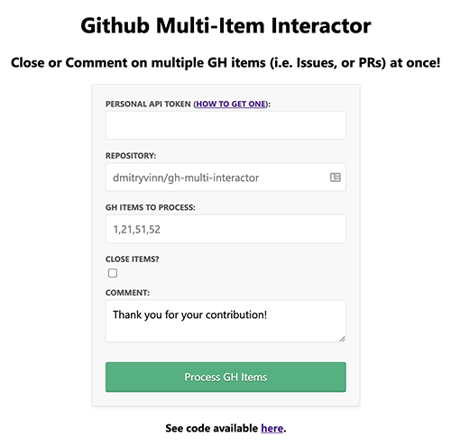

# GitHub Multi-Item Interactor

## Overview

This app helps users interact with multiple GitHub items (i.e. issues, PRs, etc.) at once.

Currently, this app allows you to comment on and close the GitHub items.



## How to Use

1) Go to a [Heroku instance of the app](https://gh-multi-interactor.herokuapp.com/)

2) Enter your [Personal GitHub API Token](https://help.github.com/en/github/authenticating-to-github/creating-a-personal-access-token-for-the-command-line) for the repo

3) Enter repo name following a format: [ORG_NAME/REPO_NAME]. To illustrate, for "https://github.com/nodejs/node" only enter *"nodejs/node"*

4) Enter GH items to process. It can be a single issue/PR, or multiple (comma delimited). For example, for [issue A](https://github.com/dmitryvinn/tea-shop-flexbox/issues/1) and a [pull request B](https://github.com/dmitryvinn/tea-shop-flexbox/pull/5), you can enter "1,5".
    **Note:** You can combine pull request and issues in a single request
    **Note:** Find case number in the URL, or  a heading of your GH Issue or PR
    **Note:** Do not enter more than 2500 GH items at once to prevent hitting the max API rate on GitHub

5) If you want to close the GH items entered in the previous step, check the checkbox for "Close Items?". By default, the items are not closed.
    **Note:** If you are working with already closed items, this checkbox will do nothing (i.e. it won't close the items)
    
6) Enter a comment for your GH items
    **Note:** If the field is left empty, no comment will be made on the GH issues
    **Note:** If the items are already closed, the comment will still be posted.

## Running Locally

Since this project involves using a personal API token for Github, its understandable if you want to run the app locally rather than trusting [my instance on Heroku](https://gh-multi-interactor.herokuapp.com/). 

To run the app locally:

1) Clone the repo:
```git clone git@github.com:dmitryvinn/gh-multi-interactor.git```

2) In the project's directory, install ```npm``` packages
```npm install```

3) Run the app:
```npm start```

5) Go to ```http://localhost:5000/```

## Miscellaneous

Special thanks to Joel Marcey for [an idea](https://twitter.com/JoelMarcey/status/1262915985792696320) for this project.